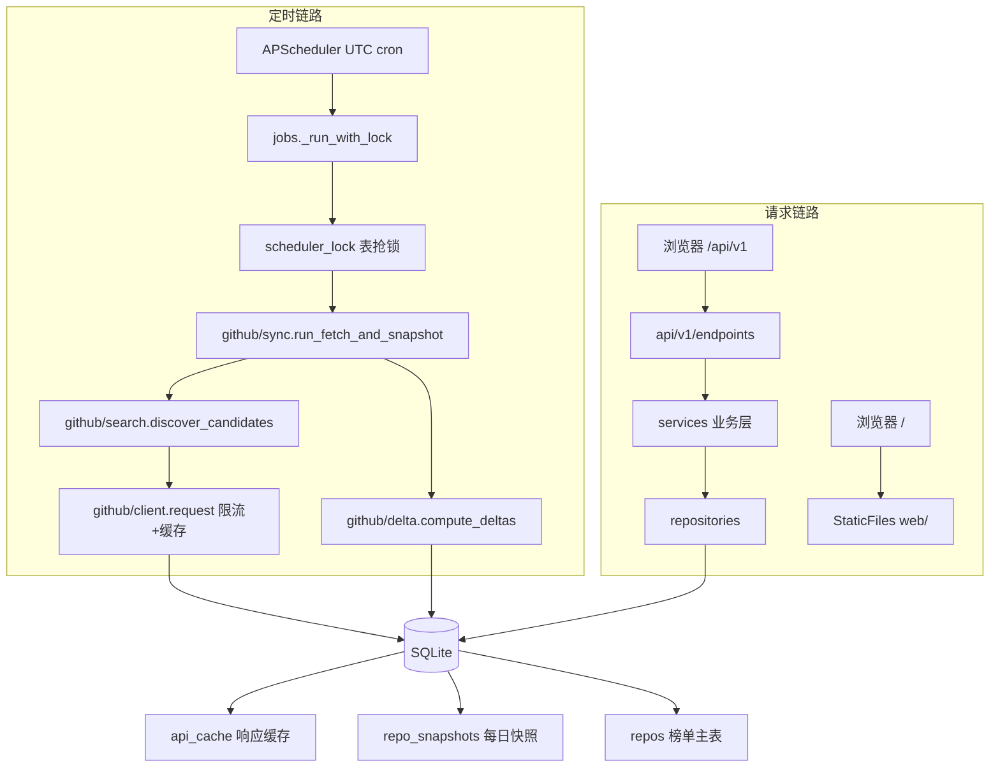

# CODEBUDDY.md This file provides guidance to CodeBuddy when working with code in this repository.

## 常用命令

当前环境为 Windows / PowerShell，所有 Python 命令统一通过 `uv run` 执行（依赖由 `pyproject.toml` + `uv.lock` 管理，`[tool.uv] package = false`，不打包安装）。

### 安装依赖

```bash
uv sync
```

按 `uv.lock` 安装运行时依赖与 dev 组（pytest / pytest-asyncio / ruff）。新增依赖后需重新执行，并提交变更后的 `uv.lock`。

### 本地运行

```bash
uv run uvicorn app.main:app --reload --host 0.0.0.0 --port 8000
```

开发模式启动，代码变更自动重载。首次启动若 `data/app.db` 为空会自动写入 120 条演示数据（含 8 天历史快照），直接访问 http://localhost:8000/ 即可看到榜单。

```bash
uv run uvicorn app.main:app --host 0.0.0.0 --port 8000 --workers 1
```

生产模式启动。`--workers 1` 是硬性约束：SQLite + WAL + NullPool 下多进程会同时启动多套 APScheduler 并争抢写锁。

### 代码检查

```bash
uv run ruff check app
```

静态检查（line-length 110，规则集 E/F/I/UP/B，忽略 B008）。提交前应全部通过。

```bash
uv run ruff check app --fix
```

同上，并自动修复可安全改写的问题（未使用的 import、格式化等）。

### 测试

```bash
uv run pytest
```

运行 `tests/` 下全部用例。`pyproject.toml` 已设 `asyncio_mode = "auto"`，异步测试无需额外标记。

```bash
uv run pytest tests/test_api_basic.py::test_favorite_flow -v
```

只运行单个用例（`tests/test_api_basic.py` 现有 `test_health`、`test_list_repos`、`test_languages`、`test_favorite_flow`）。注意测试会重建并清空 `data/app.db`。

### Docker

```bash
cp .env.example .env && docker compose up -d --build
```

构建并后台启动（compose 服务名 `gh-star-ranking`，容器名 `github-star-ranking`，数据落在命名卷 `gh-star-data`）。启动前必须在 `.env` 中填写 `GITHUB_TOKEN` 与 `ADMIN_TOKEN`。

```bash
docker compose logs -f gh-star-ranking
```

跟踪容器日志；排查抓取失败、配额耗尽时优先看这里。

### 手动触发数据抓取

```bash
curl -X POST http://localhost:8000/api/v1/admin/refresh \
     -H "X-Admin-Token: <ADMIN_TOKEN>" \
     -H "Content-Type: application/json" \
     -d '{"force": true}'
```

异步触发一轮 Github 抓取，立即返回 `{"accepted": true}`。`force: true` 忽略「今日已抓取」判断并绕过 API 响应缓存；实际结果需查看日志。

## 架构总览

项目是单体 FastAPI 应用，同时承担 RESTful 接口与定时采集任务，两条链路共用同一份 SQLite 数据库与 repository 层。



### 启动生命周期

`app/main.py` 的 `lifespan` 严格按四步执行，顺序不可调换：`setup_logging()` → `init_database()`（建表 + 写默认 `meta_info`）→ 演示数据种子（受 `DEMO_SEED_ON_EMPTY` 控制）→ `start_scheduler()`。关闭时先 `shutdown_scheduler()` 再 `engine.dispose()`。

路由注册顺序同样是约定：`/api/v1` 先注册，最后才 `app.mount("/", StaticFiles(web, html=True))`。静态挂载必须放在最后，否则会吞掉 API 路由。文档地址被改成 `/api/docs`、`/api/redoc`、`/api/openapi.json`。

### 分层职责

`api` 只做参数校验与响应封装，`services` 承载业务规则，`repositories` 封装 SQL，`models` 是 ORM 定义。跨层调用的方向是单向的：`api → services → repositories → models`，反向依赖视为坏味道。`schemas` 是 Pydantic 输出模型，`core` 放常量 / 异常 / 鉴权，`utils` 放时间与数字工具。

所有接口返回统一结构 `{code, message, timestamp, data}`，由 `app/api/response.py` 的 `ok()` 构造；`BusinessError`、`RequestValidationError`、`HTTPException` 与未捕获异常都由全局 handler 转成 `fail()`。业务错误码集中在 `app/core/errors.py`（40001 参数错误 / 40301 无权限 / 40401 不存在 / 42901 Github 配额 / 50001 内部错误）。

### 7 日 Star 增量的来源

Github 没有官方 Trending API，因此榜单的「7 日新增」是**每日快照差值**，不是接口直接返回的字段。核心规则在 `services/github/delta.py`：

- `stars_7d = 今日快照 Star 数 − 7 天前（或之前最近一条）快照 Star 数`
- 历史不足 7 天时，取最早一条快照作基线，并把 `is_partial` 置为 `True`（前端显示为估算值）
- 差值为负（取消 Star、仓库重建）时取 0
- 只处理「今日已有快照」的仓库，避免用旧数据覆盖指标

因此**榜单可信度取决于快照连续性**：任何让某仓库当天没有快照的改动，都会让它的 `stars_7d` 长期冻结在旧值且无任何告警。

### 采集链路与限流

`tasks/scheduler.py` 注册三个 UTC 任务（抓取、重算增量、每周清理），`tasks/jobs.py` 用 `scheduler_lock` 表的「锁 + 过期时间」防止并发与重复执行。`services/github/sync.py` 是主流程：发现候选（4 条搜索语句按 repo id 去重）→ 写主表 → 写今日快照 → 补全未命中的已跟踪仓库 → 计算增量 → 可选 stargazers 回填估算。

`services/github/client.py` 把配额治理集中在一处：所有请求用 `asyncio.Lock` 串行化并遵守最小间隔（Search API 间隔更大），每次响应后读取 `X-RateLimit-*` 写入 `meta_info` 供 `/api/v1/meta/stats` 展示；配额低于阈值或遇到 403/429 时抛 `GithubRateLimitError`，上层保留已抓到的数据并提前结束本轮，而不是整体失败。

响应缓存落在 `api_cache` 表（key 为请求 md5，默认 TTL 6 小时）。`ttl` 为 `0` 时**同时跳过读缓存与写缓存**——这正是管理接口 `force: true` 的实现方式：`run_fetch_and_snapshot` 把 `cache_ttl=0` 透传给 `discover_candidates` 与 `_sync_missing_repos` 两条链路。

### 收藏的隔离模型

收藏不依赖登录：浏览器 `localStorage` 生成 UUID，通过 `X-Client-Id` 请求头传入，服务端以此隔离 `favorites` 记录。列表接口的 `only_favorites` 过滤在 `repo_repo.build_query()` 里 join `favorites` 表完成，`is_favorite` 标记则通过预先取一次收藏 ID 集合避免 N+1。缺少该请求头时收藏相关操作按空集合处理（写操作直接 400）。

### 前端

`web/` 是原生 HTML + JS，Tailwind 与 particles.js 已 vendor 到 `web/assets/vendor/`（离线可用），由后端 `StaticFiles` 直接托管，不经过构建步骤。前端通过 `assets/js/config.js` 里的 API 基址直连 `/api/v1`。

## 关键约定

- **时间基准统一为 UTC**：调度 cron、快照日期 `YYYY-MM-DD`、`meta_info` 里的抓取时间都用 UTC。`FETCH_CRON_HOUR=0` 对应北京时间 08:00，排查「为什么没抓」时先换算时区。
- **SQLite 场景必须 `--workers 1`**：多进程会重复启动调度器、重复写演示数据，并放大写锁竞争。
- **`.env` 必改项**：`GITHUB_TOKEN`（未认证仅 60 次/小时，认证后 5000 次，直接决定能否抓满候选池）、`ADMIN_TOKEN`（默认值公开在仓库中，不改等于任何人都能触发刷新消耗配额）。
- **演示数据开关**：库里已有真实数据后设 `DEMO_SEED_ON_EMPTY=false`，避免重启时再次写入模拟仓库。
- **无迁移工具**：表结构由 `Base.metadata.create_all` 创建，改字段后需要手工处理存量库。

## 已知陷阱

1. **循环导入**：`app/db/__init__.py` 同时导出 `base`（`app.models` 依赖它）与 `init_db`（依赖 `app.models`），形成 `app.db ↔ app.models` 环。应用本身靠 import 顺序侥幸可启动；任何以 `import app.services.*` 或 `import app.models.*` 开头的独立脚本会直接抛 `ImportError: cannot import name 'ApiCache' from partially initialized module 'app.models'`。规避：脚本首行先写 `from app.db.session import AsyncSessionLocal`。
2. **分页排序必须带次排序键**：`repo_repo.build_query()` 在排序后追加了 `Repo.repo_id.asc()`。删除它会导致同分（例如新部署时 `stars_7d` 全为 0）时 SQLite 返回顺序不定，`LIMIT/OFFSET` 分页出现跨页重复与漏项。
3. **force 刷新需两条链路同步**：只改 `discover_candidates` 的 `cache_ttl` 不够，`_sync_missing_repos` 的 `ttl` 参数也要透传，否则补全分支仍读缓存，force 静默失效。
4. **测试与开发共用同一个数据库文件**：`tests/conftest.py` 的 autouse fixture 在每个用例后 `drop_all`，跑完 `uv run pytest` 后 `data/app.db` 是空的，再启动服务会重新种子演示数据。不要在测试运行时对同一库做手工验证。
5. **调度器与演示数据无多进程保护**：`start_scheduler()` 与种子写入在 lifespan 中执行，没有跨进程互斥，只能靠部署约定（`--workers 1`）保证。
